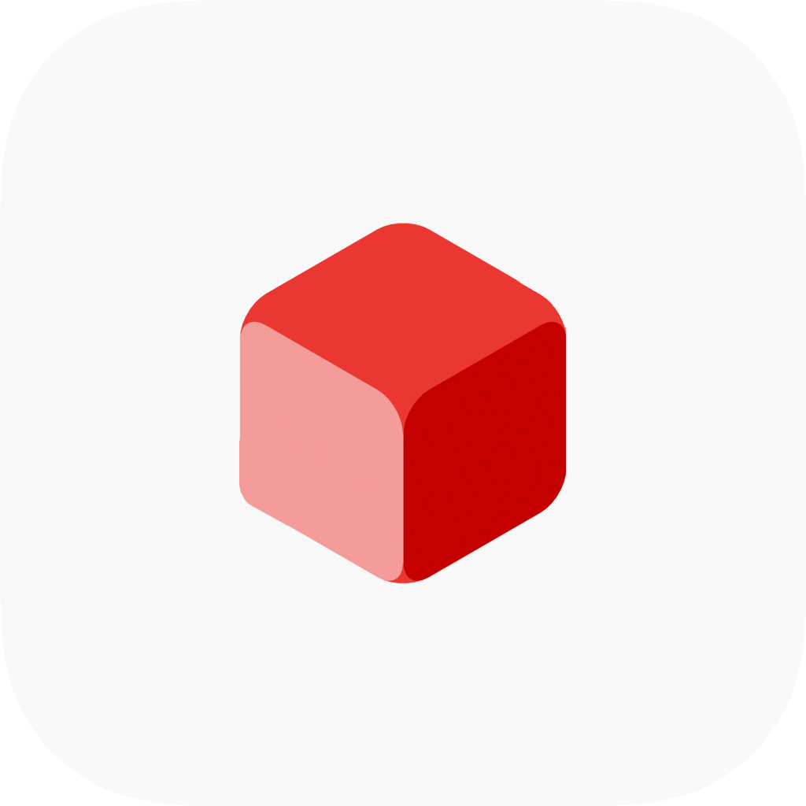

[](https://www.gnu.org/licenses/gpl-3.0)
[]()



# EmblaCoreJS

EmblaCoreJS is a TypeScript/JavaScript library containing the core session functionality in [Embla](https://github.com/mideind/EmblaFlutterApp), a cross-platform mobile Icelandic-language voice assistant client.

For the Dart/Flutter library see [EmblaCoreFlutter](https://github.com/mideind/EmblaCoreFlutter).

## Local Installation

Use [yarn](https://yarnpkg.com) to install dependencies.

```bash
yarn install
```

To build the project run:

```bash
yarn run build
```

This compiles the TypeScript code into JavaScript libraries found in `lib/`, named `lib/emblacore.js` and `lib/emblacore.min.js`.

## Documentation

Documentation can be generated by running:

```bash
yarn run doc
```

## Testing

Tests can be run with:

```bash
yarn run test
```

The HTML files can then be found in the `lib/doc/` directory.

## Example

Example usages can be found in the `examples/` directory (currently only contains an example of usage in a browser environment).

### Browser example

To test the library in a browser environment navigate to the `examples/browser/` directory and run the following command (requires Python 3):

```bash
python3 -m http.server --bind 127.0.0.1 8000
```

Open the following URL in the browser: [`http://localhost:8000/client.html`](http://localhost:8000/client.html).
Note that running the example may require an API key for the server EmblaCoreJS is configured to communicate with.

## License

EmblaCore is Copyright &copy; 2023 [Miðeind ehf.](https://mideind.is)

<a href="https://mideind.is"></a>

This set of programs is free software: you can redistribute it and/or modify it
under the terms of the GNU General Public License as published by the Free
Software Foundation, either version 3 of the License, or (at your option) any later
version.

This set of programs is distributed in the hope that it will be useful, but WITHOUT
ANY WARRANTY; without even the implied warranty of MERCHANTABILITY or FITNESS FOR
A PARTICULAR PURPOSE. See the GNU General Public License for more details.

The full text of the GNU General Public License v3 is
[included here](./LICENSE.txt)
and also available here:
[https://www.gnu.org/licenses/gpl-3.0.html](https://www.gnu.org/licenses/gpl-3.0.html).

If you wish to use this set of programs in ways that are not covered under the
GNU GPLv3 license, please contact us at [mideind@mideind.is](mailto:mideind@mideind.is)
to negotiate a custom license. This applies for instance if you want to include or use
this software, in part or in full, in other software that is not licensed under
GNU GPLv3 or other compatible licenses.

## Attributions

EmblaCoreJS uses [RecordRTC](http://recordrtc.org/), which is Copyright &copy; [Muaz Khan](https://github.com/muaz-khan).
